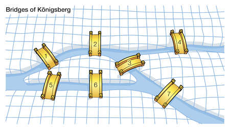
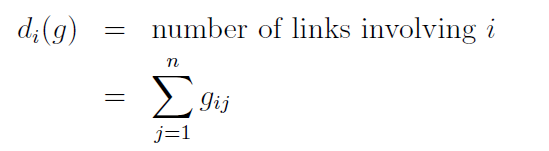
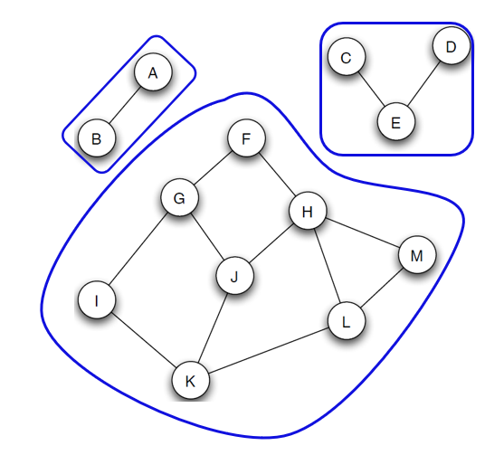

# The Graph Theory - An Introduction In Python
Author: Sofiyan Sheikh

One growing area of interest for scientists exploring importance, power, or influence among entities is called the Graph Theory. Graph Theory's roots began in 1736 when mathematician Carl Ehler introduced Leonhard Euler to the Bridges of Konigsberg problem.

The Bridges of Konigsberg problem is based in the former German city of Konigsberg which lays on both sides of the Pregel River. In the center, there were two large islands which were connected to each other and to the riverbanks by seven bridges. Carl Ehler became obsessed with finding a route to walk through each of the seven bridges without walking over any of them more than once. Ehler reached out to Leonhard Euler, a Swiss mathematician. Euler confirmed Ehler's hypothesis that the problem did not have a solution, and Euler's explanation informed a new mathematical paradigm called Geometry of Position.

Euler's new geometry paradigm stated that the location of the bridges didn't matter.  The problem, instead, can be simplified by turning each bridge into a point (node) with lines (edges) to represent links between them. This practice of using nodes and edges is now known as Graph Theory.

You can read more about the Bridges in Konigsberg problem [here](https://en.wikipedia.org/wiki/Seven_Bridges_of_K%C3%B6nigsberg).

Initially, Graph Theory didn't serve much purpose in problem solving and was not highly regarded by mathematicians. However, modern computational power to process large permutations has made Graph Theory's principles more practical. This article teach you to apply Graph Theory principles to Python-based analysis.

## Graph Theory Overview

In the Graph Theory, a graph has a finite set of vertices (*V*) connected to two-elements (*E*). Each vertex (*v*) connecting two destinations, or nodes, is called a link or an edge. Consider the Graph of bike paths below: sets {K,L}, {F,G}, {J,H}, {H,L}, {A,B}, and {C,E} are examples of edges.

The total number of edges for each node is the degree of that node. In the Graph above, M has a degree of 2 ({M,H} and {M,L}) while B has a degree of 1 ({B,A}). Degree is described formally as:

Connections through use of multiple edges are called paths. {F, H, M, L, H, J, G, I} is an example of a path. A simple path is when a path does not repeat a node - formally known as Eulerian path. {I, G, J, H, F} is an example of a simple path. The shortest simple path is called Geodesic. Geodesic between I and J is {I, G, J} or {I, K, J}. Finally, a cycle is when a path's start and end points are the same (ex. {H,M,L,H}). In some notebooks, a cycle is formally referred to as Eulerian cycle.

Not all networks in a Graph system are interconnected. This disconnection is when components are formed. As shown in the graph below, a component is formed only when every node has a path to other nodes.

## Applied Graph Theory in Python

In Python, networkx is often used for applied graph theory also known as network analysis . The package has useful functionality to quickly summarize the characteristics of a graph. You can review the steps below and follow along as we create a graph and understand its makeup.

First the code below creates an graph empty object `P`. The next steps add nodes and describe the edges.

    # Initiating an empty Graph object
    P = nx.Graph() # create an empty object

    # You can add nodes using add_nodes_from()
    P.add_nodes_from(['A','B','C','D', 'E'])

    # Use add_edges_from to add pairwise relationships
    P.add_edges_from ([('B','C'), ('A','C'), ('B','D'), ('D','A'), ('D','E'), ('B','E')])

Arguments such as `<object>.nodes()` or `<object>.edges()` are quick ways to view all nodes and edges of the graph system.

    print(P.nodes())

    print(P.edges())

Finally, `nx.draw` is used to visualize the network.

    %matplotlib inline
    import matplotlib.pyplot as plt
    nx.draw(P, with_labels = True)

## **Exercises 1:**

Now that basic concepts of graphs are discussed, the following exercises are a good method to practice:

- How many nodes are in the above graph?
- How many edges are in the above graph?
- What is the Geodesic for E and C?
- Are there more than 1 component in the graph?

## Using Real Data

The exercise below will use flights within Unites States in 2015, and the data contain origin and destination airports. In addition, attributes including air time and delays (weather, security, or airline related) are recorded to describe the flight.

Because the dataset is large, the exercise will concentrate on flights originating from Los Angeles area airports (Los Angeles (LAX), Burbank (BUR), Orange County (SNA), and San Bernardino County (ONT)). In addition, the focus will be to review flights that resemble my Deloitte travel schedule - flying out on Sundays and returning on Thursday.

    #import packages
    import pandas as pd
    import numpy as np

    #import data file (subset of original file)
    file = pd.read_csv("C:\\Users\\sofsheikh\\Desktop\\python\\Journal - Intro to Graphy Theory 1\\flights.csv", low_memory = False)

    #review dataframe structure
    file.shape

    #review data
    file.head()

The data needs to a little updating because the time fields are recorded as generic numbers (float64). Fields such as AIR_TIME will be used later in this analysis so it would be best to convert it now. The code below adds a colon to the AIR_TIME field.

    # converting AIR_TIME
    file['AIR_TIME'] = file.AIR_TIME.astype(str).str.replace('(\d{2}$)', '') + ':' + file.AIR_TIME.astype(str).str.extract('(\d{2}$)', expand=False)

Since we already have origination and destination data, Fields ORIGIN_AIRPORT and DESTINATION_AIRPORT will serve as source fields for nodes and edges - there is no need to create nodes or edges as we did in the first exercise. Once nodes are defined, <object>.edges() will provide all pairwise relationships between them. Finally, nx.draw will help produce a graph to the edges.

    import networkx as nx
    FG = nx.from_pandas_edgelist(file2, source='ORIGIN_AIRPORT', target='DESTINATION_AIRPORT', edge_attr=True)
    FG.nodes()

    FG.edges()

    nx.draw(FG, with_labels = True)

In the output above, nodes are labeled with Airport Codes. All edges lead to one of four Los Angeles area airport because those four were the only ones selected for this exercise. Los Angeles International (LAX) is the largest airport among the four and the graph clearly shows that many cities are only accessible for LAX and not from other smaller airports. This showcases the connectedness, or degree centrality, of LAX. In networkx, nx.algorithms.degree_centrality(<object>) is used to find centrality of each node in the graph system.

    # Calculating the centrality of each of the airports
    nx.algorithms.degree_centrality(FG)

We can go more granular and use a short 'for loop' to produce edges between two areas of interest. For example, the following code is used to find all possible flights from San Bernardino County (ONT) to Newark (EWR) on either Sunday or Thursday.

    # What options are available to fly from San Bernardino County to Newark, NJ?
    for path in nx.all_simple_paths(FG, source='ONT', target='EWR'):
     print(path)

Among the several flight options between San Bernardino County and Newark, the nx.dijkstra_path can be used to find the Euclidean path (or the shortest path). The code below adds 'AIR_TIME' as a weight when computing the shortest path.

    #Finding the dijkstra path weighted by airtime (approximate case)
    djk_path = nx.dijkstra_path(FG, source='ONT', target='EWR', weight='AIR_TIME')
    djk_path

## Exercises 2:

- Produce the following graph using nx.draw().
Note: your network may not look exactly the same but the paths, edges, and nodes should match the network below.
- Print all the edges.
- What is the shortest path from L to F?

    #Exercise Solution Code

    # Add a node
    NG.add_nodes_from(['A','B','C','D', 'E', 'F', 'G', 'H', 'I', 'J', 'K', 'L']) # Add a list of nodes by passing a list argument

    # Add edges
    NG.add_edges_from([('A', 'B'),('C','E'),('D','E'), ('F','G'), ('F','H'), ('G', 'J'), ('H', 'J'), ('H', 'M'), ('H','L'), ('M', 'L'), ('J', 'K'), ('J', 'G'), ('K', 'I'), ('I', 'G'), ('L', 'K')])

    NG = nx.from_pandas_edgelist(ntwrk, source='source', target='target', edge_attr=True)
    NG.nodes()

    NG.edges()

    nx.draw(NG, with_labels = True)

    #shortest path
    djk_path = nx.dijkstra_path(NG, source='L', target='F')
    djk_path
